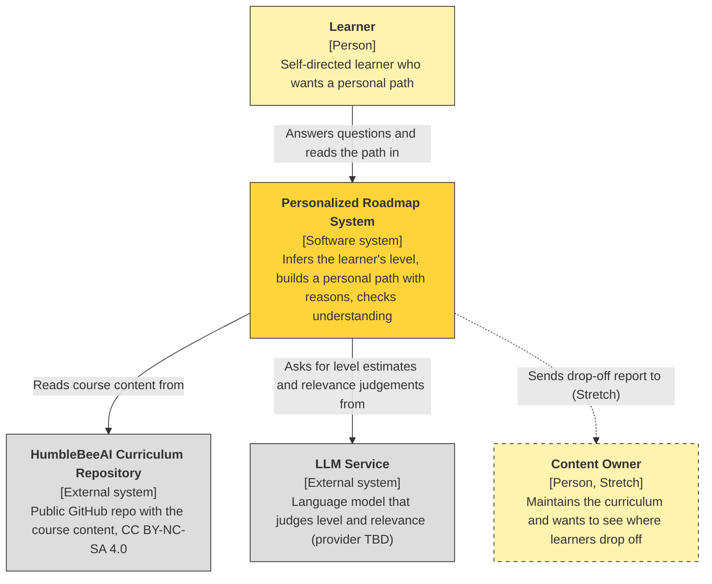
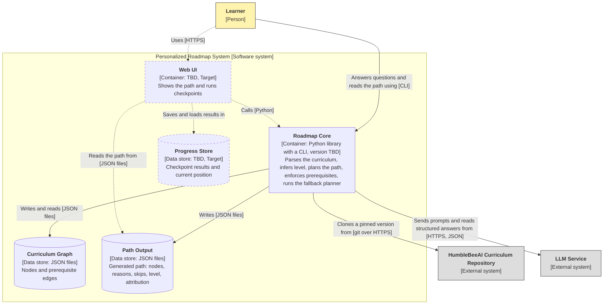

# Architecture: C4 Level 1 and Level 2 (draft)

**Status:** initial draft for the 23 September submission. Things we have not decided are marked **TBD**.

The diagrams are written in Mermaid, which GitHub draws automatically. **Dashed** boxes and arrows are Target or Stretch items, not Baseline.

We draw only Level 1 and Level 2 for now, as the course guide asks. We will update them as the implementation changes.

---

## C1: System Context

**Question it answers:** who uses the system, what are we building, and what does it connect to outside itself?

**How to read it**

- The yellow box is what our team builds. Everything outside it is a person or an external system we do not control.
- The learner is the only user in Baseline. The content owner appears only in the Stretch item "drop-off analysis".
- We do **not** copy the curriculum into our repository. We read it from its own repository at a pinned version.
- Every arrow says what the connection is used for.

---

## C2: Container

**Question it answers:** what are the main applications and data stores inside the system, and how do they talk to each other?

The language model service is drawn **outside** the system boundary because we call it, we do not run it.

### What each container does

| Container | Responsibility | Technology | Tier |
|---|---|---|---|
| Roadmap Core | Turns the curriculum into a graph; reads the onboarding questions from a config file in the repo; infers the level and explains why; builds an ordered path; marks and justifies skipped items; enforces prerequisites; falls back to a rule-based planner when no model is available | Python library with a CLI (Python version TBD) | Baseline |
| Curriculum Graph | Stores the parsed curriculum (modules, sections, resources) and the prerequisite edges that our team writes by hand | JSON files, rebuilt from a pinned commit | Baseline |
| Path Output | The generated path. This JSON is the contract: any interface only needs to read it | JSON files | Baseline |
| Web UI | Shows the path, runs checkpoint questions, lets the learner correct the level | TBD (Streamlit, Gradio or a small web app) | Target |
| Progress Store | Remembers checkpoint results and where the learner is in the path | TBD (local file, SQLite or browser storage) | Target |

### Key decisions

1. **The core is a library plus a CLI, not a service.** Baseline needs no HTTP API and no database. We add them only when the Target web interface needs them. This matches the "Basic Python module" starter template we chose.
2. **The path JSON is the contract** between the core and any interface.
3. **The LLM is used only where a judgement is needed** (level and relevance). Order, prerequisites and attribution are ordinary code, so they can be tested and still work without a model.
4. **The curriculum stays outside our repository.** We clone it at a pinned commit and record the licence.

### Open points (TBD)

- Python version, and whether the Baseline interface is a command line, a script or a notebook.
- Web UI technology, and where progress is stored (Target only).
- Which LLM and which free path we use (Q-003 in `questions.md`).
- Whether we may send curriculum text and learner answers to an external AI service (Q-005).
- What counts as "human review and approval" of what the learner sees (Q-006).
- Whether hosting is Hugging Face Spaces or something else (free tier only).

### Not shown on purpose

The modules inside the core (parser, planner, level inference, checkpoint generator) belong to Level 3. We will draw them if the mid-course review needs them.
